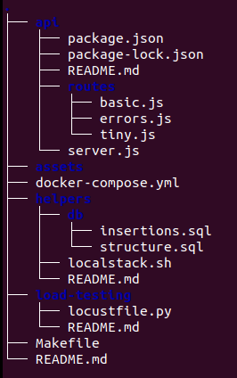

# Local Testing Services

Some services and helpers to provide local testing options and boost your productivity :rocket:

## :key: Dependencies

- [Docker](https://docs.docker.com/engine/install/)
- [Docker Compose](https://docs.docker.com/compose/install/)
- [NPM](https://docs.npmjs.com/downloading-and-installing-node-js-and-npm)
- [Node.js](https://docs.npmjs.com/downloading-and-installing-node-js-and-npm)
- [pip](https://pip.pypa.io/en/stable/installation/)
- [Python 3.10](https://www.python.org/downloads/)

## :bulb: All services

|Name|Goal|Stack|Ready to Use?|
|---|---|---|---|
|Local Testing API|Provide sample endpoints call on local tests|Node.js and Express| :white_check_mark:|
|Local Testing DB|Provide a PostgreSQL database to call on local APIs or run queries/triggers|Docker and Docker Compose|:white_check_mark:|
|Localstack|Provide local AWS services such as SNS and SQS|Docker and Docker Compose|:x:|
|Stress Tester|Provides an interface to execute stress tests|Python, pip and Locust (Python module)|:x:|

## :hammer: Project structure



Here are some relevant directories and files:

### `api`

The *Local Testing API* directory. The structure follows the Node.js + Express REST APIs convention.

For more details check the [README](./api/README.md).

### `helpers`

Contains useful scripts to services and all the general purposes.

- `db` directory contains some useful SQL queries to create the testing database and other related purposes.
- `localstack.sh` is the Localstack starting script.

For more details check the [README](./helpers/README.md).

### `load-testing`

The *Stress Tester* directory that contains a single `locustfile.py` to execute the tests.

For more details check the [README](./load-testing/README.md).

### `docker-compose.yml`

Contains all the Docker provided services.

- `local_db`: PostgreSQL database to testing.
- `localstack`: *TO BE DEFINED*

For more details check the [`docker-compose.yml`](./docker-compose.yml).

### `Makefile`

Has all of the necessary and useful commands to run the services. You can run commands by `make <listed command>` at the this directory.

For more details check the [`Makefile`](./Makefile).

### `.env.example`

The environment variables example file.

:warning: **Important:** it must have the environment variables for all services!

## :running: Running services

First of all you'll need to copy `.env.example` file:

```bash
cp .env.example .env
```

The `Makefile` provides some alias for different commands and and maintain all of then on the same file and directory. 

Now :smile: from root directory:

### Simple API

To install dependencies:
```bash
make api-install
```

To run the API:
```bash
make api-run
```

### Sample Database

To start, stop and restart the database:
```bash
make db-start

make db-stop

make db-restart
```

To see database logs
```bash
make db-logs
```

To access PostgreSQL shell:
```bash
make db-shell
```

### Localstack with SNS/SQS

*TO BE DEFINED*

### Load testing using Locust

*TO BE DEFINED*

## :bookmark_tabs: TODOs

- [ ] Stress Tester
  - [ ] Define `locustfile.py` correctly to simple load test
  - [ ] Write README file
  - [ ] Run Locust on Docker
- [ ] Localstack
  - [ ] Install localstack on Docker Compose
  - [ ] Create init script containing SNS topic and SQS Queue
- [ ] Local Testing API
  - [ ] Implement custom error responses endpoints
- [ ] Local Testing DB
  - [ ] Create basic structure query
  - [ ] Create insertions query


--- 

Made to help daily testing when you don't have automated testing or some kind of staging environment with :heart: by RafaelEmery 


